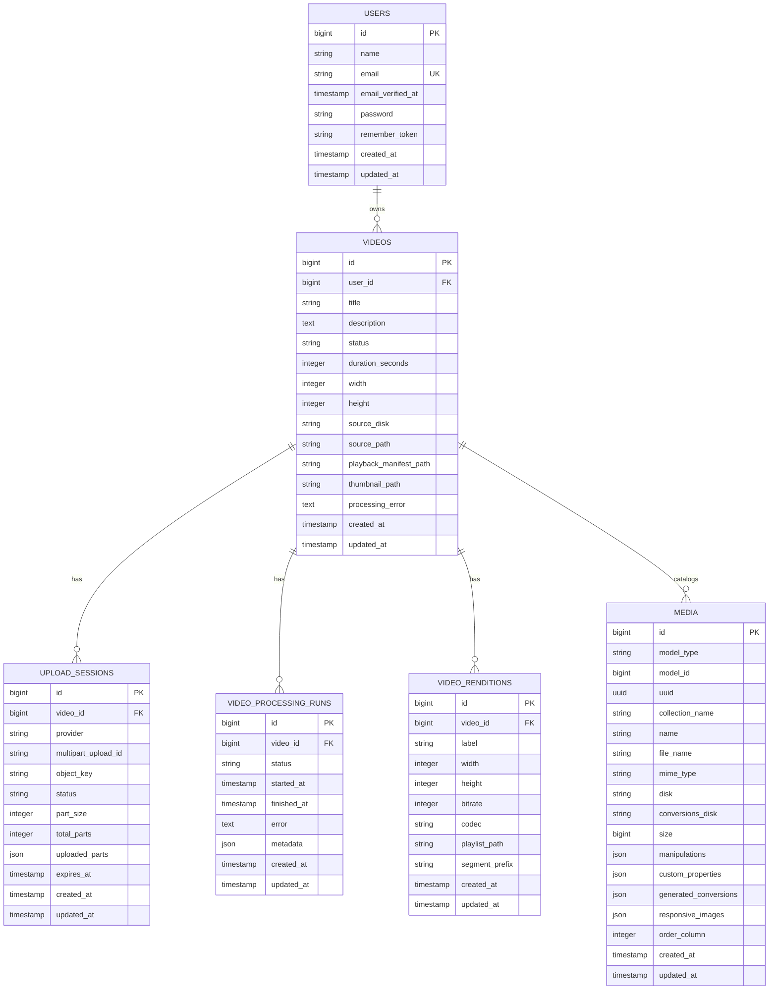

# StreamOps Media Library Architecture Plan

This document captures the intended database and application architecture for adding Spatie Laravel Media Library to StreamOps.

The key decision is that Spatie Media Library is used as a media catalog for important media artifacts, not as the streaming pipeline or processing state machine.

## Core Principle

- [ ] Use StreamOps domain tables as the source of truth for upload, processing, playback, and workflow state.
- [ ] Use Spatie Media Library to catalog meaningful files attached to domain models.
- [ ] Do not use Spatie to model every generated streaming segment.
- [ ] Do not create one database row per HLS segment.
- [ ] Store HLS segment files in object storage under predictable paths.
- [ ] Store only the important playback entry points and metadata in the database.

## Current API State

The Laravel API currently contains only the base application scaffolding:

- [ ] `User` model exists.
- [ ] Auth scaffolding exists.
- [ ] Sanctum personal access tokens exist.
- [ ] Queue, failed job, and job batch tables exist.
- [ ] Cache and session tables exist.
- [ ] No video domain models exist yet.
- [ ] No upload session models exist yet.
- [ ] No processing/rendition models exist yet.
- [ ] Spatie Media Library is not installed yet.

Relevant files:

- `api/app/Models/User.php`
- `api/routes/api.php`
- `api/database/migrations`
- `api/composer.json`

## Recommended Domain Model

## Planned ERD

Use this Mermaid diagram as the living ERD for the first database design pass.

You can view it in:

- [ ] GitHub Markdown preview.
- [ ] VS Code with a Mermaid Markdown preview extension.
- [ ] Mermaid Live Editor at `https://mermaid.live`.
- [ ] Any documentation tool that supports Mermaid fenced code blocks.



Relationship notes:

- [ ] `users.id` -> `videos.user_id`
- [ ] `videos.id` -> `upload_sessions.video_id`
- [ ] `videos.id` -> `video_processing_runs.video_id`
- [ ] `videos.id` -> `video_renditions.video_id`
- [ ] `videos.id` -> `media.model_id` where `media.model_type` is the `Video` model class.
- [ ] `media` is Spatie's polymorphic catalog table, so it can attach to other models later if needed.

Important modeling notes:

- [ ] `video_renditions` stores one row per rendition quality, not one row per segment.
- [ ] HLS segment files live in object storage under `segment_prefix`.
- [ ] `media.collection_name` should distinguish `source`, `thumbnails`, and `playback_manifests`.
- [ ] `media.custom_properties` can store codec, bitrate, dimensions, duration, rendition labels, or provider-specific metadata.
- [ ] `videos.playback_manifest_path` and `videos.thumbnail_path` are denormalized convenience fields for fast API responses.

### User

Users own uploaded videos.

- [ ] Add a `videos()` relationship to `User`.

Expected relationship:

```php
public function videos()
{
    return $this->hasMany(Video::class);
}
```

### Video

The `videos` table should be the main domain table for uploaded videos.

It should represent the business object, not just a file.

- [ ] Create a `Video` model.
- [ ] Create a `videos` migration.
- [ ] Make `Video` belong to `User`.
- [ ] Make `Video` implement Spatie's `HasMedia` contract after Spatie is installed.
- [ ] Add Spatie's `InteractsWithMedia` trait after Spatie is installed.
- [ ] Register media collections for source files, thumbnails, and playback manifests.

Recommended columns:

- [ ] `id`
- [ ] `user_id`
- [ ] `title`
- [ ] `description`
- [ ] `status`
- [ ] `duration_seconds`
- [ ] `width`
- [ ] `height`
- [ ] `source_disk`
- [ ] `source_path`
- [ ] `playback_manifest_path`
- [ ] `thumbnail_path`
- [ ] `processing_error`
- [ ] `created_at`
- [ ] `updated_at`

Recommended statuses:

- [ ] `draft`
- [ ] `uploading`
- [ ] `uploaded`
- [ ] `queued`
- [ ] `processing`
- [ ] `ready`
- [ ] `failed`

Status ownership:

- [ ] `draft`: video record exists, upload has not started.
- [ ] `uploading`: upload session exists and parts are being uploaded.
- [ ] `uploaded`: source object exists in object storage.
- [ ] `queued`: processing job has been dispatched.
- [ ] `processing`: worker is actively generating metadata, thumbnails, renditions, and HLS outputs.
- [ ] `ready`: playback assets are available.
- [ ] `failed`: upload or processing failed.

### UploadSession

Upload sessions should be first-class records because they represent resumable multipart upload state.

- [ ] Create an `UploadSession` model.
- [ ] Create an `upload_sessions` migration.
- [ ] Make `UploadSession` belong to `Video`.
- [ ] Use this table to coordinate browser-to-object-storage multipart uploads.
- [ ] Do not store uploaded file bytes in Laravel.

Recommended columns:

- [ ] `id`
- [ ] `video_id`
- [ ] `provider`
- [ ] `multipart_upload_id`
- [ ] `object_key`
- [ ] `status`
- [ ] `part_size`
- [ ] `total_parts`
- [ ] `uploaded_parts`
- [ ] `expires_at`
- [ ] `created_at`
- [ ] `updated_at`

Recommended statuses:

- [ ] `pending`
- [ ] `active`
- [ ] `completed`
- [ ] `aborted`
- [ ] `failed`

Recommended casts:

- [ ] Cast `uploaded_parts` to `array`.
- [ ] Cast `expires_at` to `datetime`.

### VideoProcessingRun

Processing runs should track worker execution separately from the `videos` table.

This makes retries, failures, and future reprocessing easier to model.

- [ ] Create a `VideoProcessingRun` model.
- [ ] Create a `video_processing_runs` migration.
- [ ] Make `VideoProcessingRun` belong to `Video`.
- [ ] Create a new processing run each time processing is attempted.
- [ ] Store extracted metadata and worker information here.

Recommended columns:

- [ ] `id`
- [ ] `video_id`
- [ ] `status`
- [ ] `started_at`
- [ ] `finished_at`
- [ ] `error`
- [ ] `metadata`
- [ ] `created_at`
- [ ] `updated_at`

Recommended statuses:

- [ ] `queued`
- [ ] `running`
- [ ] `completed`
- [ ] `failed`
- [ ] `cancelled`

Recommended casts:

- [ ] Cast `metadata` to `array`.
- [ ] Cast `started_at` to `datetime`.
- [ ] Cast `finished_at` to `datetime`.

### VideoRendition

Renditions represent generated playback quality levels such as `480p`, `720p`, and `1080p`.

This table should track playlists and segment groups, not individual segment files.

- [ ] Create a `VideoRendition` model.
- [ ] Create a `video_renditions` migration.
- [ ] Make `VideoRendition` belong to `Video`.
- [ ] Store one row per generated quality level.
- [ ] Store playlist path and segment prefix.
- [ ] Do not store one row per segment.

Recommended columns:

- [ ] `id`
- [ ] `video_id`
- [ ] `label`
- [ ] `width`
- [ ] `height`
- [ ] `bitrate`
- [ ] `codec`
- [ ] `playlist_path`
- [ ] `segment_prefix`
- [ ] `created_at`
- [ ] `updated_at`

Example rows:

```text
480p | 854x480   | playlist_path: videos/{video_id}/hls/480p/index.m3u8
720p | 1280x720  | playlist_path: videos/{video_id}/hls/720p/index.m3u8
1080p | 1920x1080 | playlist_path: videos/{video_id}/hls/1080p/index.m3u8
```

## Spatie Media Library Role

Spatie should be attached to the `Video` model.

Use Spatie for cataloging important files:

- [ ] Original/source video.
- [ ] Generated thumbnail.
- [ ] Master HLS playlist.
- [ ] Optional rendition playlists if useful.

Do not use Spatie for:

- [ ] Upload session state.
- [ ] Processing job state.
- [ ] Queue state.
- [ ] Every HLS segment.
- [ ] Adaptive bitrate switching logic.
- [ ] Streaming delivery.

Suggested collections:

- [ ] `source`
- [ ] `thumbnails`
- [ ] `playback_manifests`

Possible custom properties:

- [ ] `duration_seconds`
- [ ] `width`
- [ ] `height`
- [ ] `codec`
- [ ] `bitrate`
- [ ] `rendition_label`
- [ ] `storage_provider`
- [ ] `object_key`

Example model shape:

```php
use Spatie\MediaLibrary\HasMedia;
use Spatie\MediaLibrary\InteractsWithMedia;

class Video extends Model implements HasMedia
{
    use InteractsWithMedia;

    public function registerMediaCollections(): void
    {
        $this->addMediaCollection('source')->singleFile();
        $this->addMediaCollection('thumbnails')->singleFile();
        $this->addMediaCollection('playback_manifests')->singleFile();
    }
}
```

## Object Storage Layout

Use predictable paths in object storage.

- [ ] Keep original/source videos under a source prefix.
- [ ] Keep generated thumbnails under a thumbnail prefix.
- [ ] Keep HLS outputs under a grouped playback prefix.
- [ ] Keep all HLS files for a video grouped by video ID.

Recommended layout:

```text
videos/{video_id}/source/original.{ext}
videos/{video_id}/thumbnails/default.jpg
videos/{video_id}/hls/master.m3u8
videos/{video_id}/hls/480p/index.m3u8
videos/{video_id}/hls/480p/segment_00001.ts
videos/{video_id}/hls/480p/segment_00002.ts
videos/{video_id}/hls/720p/index.m3u8
videos/{video_id}/hls/720p/segment_00001.ts
videos/{video_id}/hls/1080p/index.m3u8
videos/{video_id}/hls/1080p/segment_00001.ts
```

Database should know:

- [ ] Source object path.
- [ ] Thumbnail object path.
- [ ] Master playlist path.
- [ ] Rendition playlist paths.
- [ ] Rendition segment prefixes.
- [ ] Processing status.
- [ ] Playback readiness.

Object storage should hold:

- [ ] Original video bytes.
- [ ] Thumbnail image bytes.
- [ ] HLS master playlist.
- [ ] HLS rendition playlists.
- [ ] HLS segment files.

## Upload Flow

- [ ] Authenticated user requests a new upload.
- [ ] API creates a `videos` row with status `draft` or `uploading`.
- [ ] API creates an `upload_sessions` row.
- [ ] API starts multipart upload with S3/R2/MinIO.
- [ ] API returns presigned part upload URLs.
- [ ] Browser uploads parts directly to object storage.
- [ ] Browser confirms upload completion with API.
- [ ] API verifies object exists in storage.
- [ ] API marks upload session as `completed`.
- [ ] API marks video as `uploaded`.
- [ ] API catalogs the source video in Spatie's `source` collection if appropriate.
- [ ] API dispatches video processing job.
- [ ] API marks video as `queued`.

## Processing Flow

- [ ] Worker receives processing job.
- [ ] Worker creates a `video_processing_runs` row with status `running`.
- [ ] Worker downloads or streams the source video from object storage.
- [ ] Worker extracts metadata.
- [ ] Worker updates `videos.duration_seconds`, `videos.width`, and `videos.height`.
- [ ] Worker generates thumbnail.
- [ ] Worker stores thumbnail in object storage.
- [ ] Worker catalogs thumbnail in Spatie's `thumbnails` collection.
- [ ] Worker generates HLS master playlist.
- [ ] Worker generates rendition playlists.
- [ ] Worker generates HLS segment files.
- [ ] Worker uploads generated HLS files to object storage.
- [ ] Worker creates one `video_renditions` row per rendition.
- [ ] Worker stores the master playlist path on `videos.playback_manifest_path`.
- [ ] Worker catalogs the master playlist in Spatie's `playback_manifests` collection if useful.
- [ ] Worker marks processing run as `completed`.
- [ ] Worker marks video as `ready`.

## Failure Handling

- [ ] If upload fails, mark upload session as `failed`.
- [ ] If upload fails, mark video as `failed` when appropriate.
- [ ] If multipart upload is cancelled, mark upload session as `aborted`.
- [ ] If processing fails, mark processing run as `failed`.
- [ ] If processing fails, store the error message on `video_processing_runs.error`.
- [ ] If processing fails, copy a user-facing summary to `videos.processing_error`.
- [ ] If processing fails, mark video as `failed`.
- [ ] Keep enough metadata to retry processing without re-uploading the original source file.

## Implementation Order

- [ ] Install Spatie Media Library.
- [ ] Publish Spatie's migration.
- [ ] Run migrations locally after reviewing generated schema.
- [ ] Create `Video` model and migration.
- [ ] Add `videos()` relationship to `User`.
- [ ] Create `UploadSession` model and migration.
- [ ] Create `VideoProcessingRun` model and migration.
- [ ] Create `VideoRendition` model and migration.
- [ ] Add relationships between all domain models.
- [ ] Add casts for JSON and datetime columns.
- [ ] Add status constants or enums.
- [ ] Add Spatie `HasMedia` and `InteractsWithMedia` to `Video`.
- [ ] Register `source`, `thumbnails`, and `playback_manifests` collections.
- [ ] Configure object storage disks.
- [ ] Implement upload creation endpoint.
- [ ] Implement multipart upload part URL generation.
- [ ] Implement upload completion endpoint.
- [ ] Dispatch processing job after upload completion.
- [ ] Implement processing job skeleton.
- [ ] Add metadata extraction.
- [ ] Add thumbnail generation.
- [ ] Add rendition generation.
- [ ] Add HLS playlist and segment generation.
- [ ] Store generated outputs in object storage.
- [ ] Save rendition records.
- [ ] Save Spatie media records for source, thumbnail, and master playlist.
- [ ] Add API resources for video responses.
- [ ] Add feature tests for upload creation.
- [ ] Add feature tests for upload completion.
- [ ] Add feature tests for processing state transitions.

## Guardrails

- [ ] Keep Spatie as a cataloging layer.
- [ ] Keep video workflow state in StreamOps tables.
- [ ] Keep upload state in `upload_sessions`.
- [ ] Keep processing attempt state in `video_processing_runs`.
- [ ] Keep playback quality metadata in `video_renditions`.
- [ ] Keep HLS segments out of the database.
- [ ] Keep Laravel out of the hot path for large file bytes.
- [ ] Let the browser upload directly to object storage.
- [ ] Let the video player stream from object storage or CDN.

## Open Decisions

- [ ] Decide whether `thumbnail_path` should remain on `videos` or only live in Spatie media.
- [ ] Decide whether `playback_manifest_path` should remain on `videos` or only live in Spatie media.
- [ ] Decide whether source media should be added to Spatie immediately after upload completion or after metadata extraction.
- [ ] Decide whether processing retries create new `video_processing_runs` rows every time.
- [ ] Decide whether statuses should be PHP enums.
- [ ] Decide whether IDs should stay auto-increment integers or use UUID/ULID for public video URLs.

## Recommended Default Decisions

- [ ] Keep `thumbnail_path` on `videos` for fast API reads and also catalog it in Spatie.
- [ ] Keep `playback_manifest_path` on `videos` for fast player bootstrapping and also catalog it in Spatie.
- [ ] Add source media to Spatie after upload completion.
- [ ] Create a new `video_processing_runs` row for every processing attempt.
- [ ] Use PHP enums for statuses if the project is ready for that pattern.
- [ ] Consider ULIDs for public-facing video IDs.
