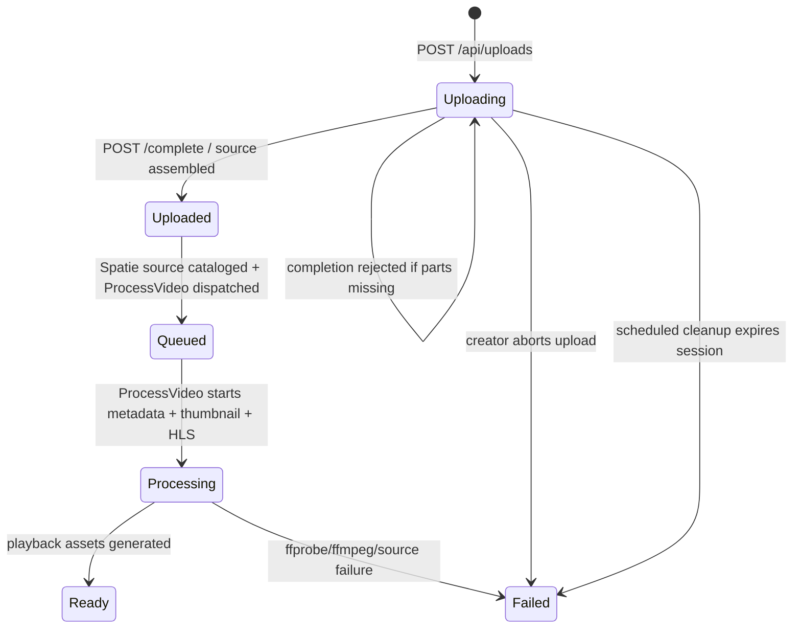
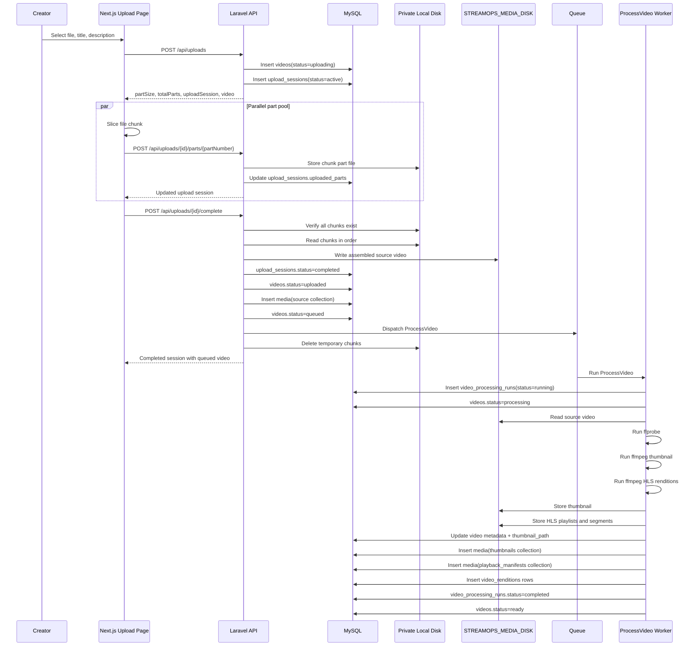
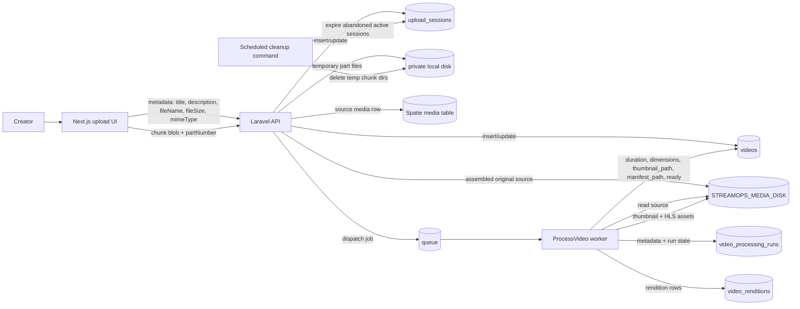

# StreamOps Upload Video Dataflow

This document describes what happens to a video from the moment a creator selects a file until StreamOps queues it for future processing.

It reflects the current implemented local chunked upload and FFmpeg processing flow. Future S3 multipart upload and browser player integration are noted as future stages, not current behavior.

## Current System Boundary

Current upload and metadata/thumbnail processing implementation:

- Browser uploads a selected source video in sequential chunks.
- Browser can resume an active upload after refresh by matching the same local file to saved session metadata.
- Browser uploads chunks in a small parallel pool.
- Creator can cancel an active upload session.
- Laravel receives chunk requests through authenticated API routes.
- Temporary chunks are stored on the private `local` disk.
- Laravel assembles chunks into one original source file on `STREAMOPS_MEDIA_DISK`.
- Spatie Media Library catalogs the assembled source file in the `source` collection.
- The video moves to `queued`.
- `ProcessVideo` is dispatched, marks the video `processing`, extracts metadata, generates a thumbnail, generates HLS playback assets, then marks the video `ready`.
- Expired active upload sessions are cleaned by the scheduled `streamops:cleanup-uploads` command.

Not implemented yet:

- Direct browser-to-S3 multipart upload.
- Browser player integration against live HLS manifests.

## Actors And Stores

```text
Actor/System             Responsibility
-----------------------  ------------------------------------------------------
Creator browser          Selects video, creates upload session, slices file,
                         uploads chunks, confirms completion.

Next.js frontend         Owns upload UI state, progress display, session API
                         calls, and sequential chunk upload behavior.

Laravel API              Authenticates creator, validates metadata/chunks,
                         creates workflow records, stores chunks, assembles
                         source file, catalogs media, dispatches processing.

MySQL database           Stores videos, upload sessions, media catalog records,
                         jobs, and processing run records.

Private local disk       Stores temporary chunk files during upload only.

Configured media disk    Stores final source video. Local mode uses `public`.
                         Cloud mode will use `s3`.

Queue backend            Stores dispatched `ProcessVideo` jobs.

Worker                   Executes `ProcessVideo`. Current worker extracts
                         metadata, generates thumbnail, and records run state.
```

## Data Stores And Tables

### `videos`

Main business record for the uploaded video.

Important fields during upload:

- `id`: ULID public video identifier.
- `user_id`: creator who owns the video.
- `title`: creator-provided title.
- `description`: optional creator-provided description.
- `status`: upload/processing lifecycle status.
- `source_disk`: configured storage disk, normally `public` locally.
- `source_path`: final assembled source path.
- `playback_manifest_path`: remains `null` in the current upload phase.
- `thumbnail_path`: remains `null` in the current upload phase.
- `duration_seconds`, `width`, `height`: remain `null` until future FFmpeg metadata extraction.
- `processing_error`: remains `null` unless a later processing stage fails.

Upload status transitions in the current implementation:

```text
uploading -> uploaded -> queued
```

The public catalog still filters to `ready` videos only, so videos are creator/dashboard-visible during upload and processing, then public-watchable after HLS processing succeeds.

### `upload_sessions`

Coordinates one upload attempt for one video.

Important fields:

- `video_id`: video being uploaded.
- `provider`: configured media disk name, such as `public` or `s3`.
- `multipart_upload_id`: `null` for current local uploads.
- `object_key`: final source object path.
- `status`: current upload-session state.
- `part_size`: chunk size returned to the frontend.
- `total_parts`: number of chunks the browser must upload.
- `uploaded_parts`: JSON array of uploaded chunk metadata.
- `expires_at`: session expiry timestamp.

Current `uploaded_parts` shape:

```json
[
  {
    "partNumber": 1,
    "etag": "sha256-of-local-chunk",
    "size": 2031616
  }
]
```

Upload-session transitions in the current implementation:

```text
active -> completed
```

### `media`

Spatie Media Library catalog table.

Current upload creates one media row after successful assembly:

- `model_type`: `App\Models\Video`
- `model_id`: video ULID.
- `collection_name`: `source`
- `disk`: same as `videos.source_disk`
- `file_name`: original assembled source file name from the stored source object.
- `custom_properties.storage_provider`: configured disk name.
- `custom_properties.object_key`: final source path.

Spatie is not used for temporary chunks and is not used for individual future HLS segments.

### `jobs`

Laravel queue table when `QUEUE_CONNECTION=database`.

Current upload dispatches `App\Jobs\ProcessVideo` after the video is queued.

### `video_processing_runs`

Current `ProcessVideo` creates a processing run row:

- `video_id`: uploaded video.
- `status`: starts as `running`, then becomes `completed` or `failed`.
- `metadata`: stores duration, dimensions, codec, bitrate, frame rate, raw ffprobe output, thumbnail path, rendition data, playback manifest path, and notes.
- `started_at`: set when processing starts.
- `finished_at`: set when processing completes or fails.
- `error`: set when processing fails.

It updates the video to `ready` only after thumbnail, HLS master manifest, rendition playlists, segments, and rendition rows are created.

## Configuration Inputs

```text
STREAMOPS_MEDIA_DISK=public
STREAMOPS_UPLOAD_PART_SIZE=8388608
STREAMOPS_MAX_UPLOAD_SIZE_KB=20971520
STREAMOPS_UPLOAD_SESSION_TTL_MINUTES=120
MEDIA_LIBRARY_MAX_FILE_SIZE=21474836480
STREAMOPS_FFMPEG_PATH=ffmpeg
STREAMOPS_FFPROBE_PATH=ffprobe
STREAMOPS_PROCESSING_TIMEOUT_SECONDS=300
FILESYSTEM_DISK=public
APP_URL=http://localhost:8000
QUEUE_CONNECTION=database
```

Important local behavior:

- `STREAMOPS_UPLOAD_PART_SIZE` is the requested chunk size.
- `STREAMOPS_MAX_UPLOAD_SIZE_KB` is the maximum accepted source upload size.
- `MEDIA_LIBRARY_MAX_FILE_SIZE` must be large enough for source videos because Spatie catalogs the assembled source file after upload.
- `STREAMOPS_FFMPEG_PATH` and `STREAMOPS_FFPROBE_PATH` must point to installed binaries in the runtime environment.
- The API returns an effective chunk size capped by PHP `upload_max_filesize` and `post_max_size`.
- On this local machine, PHP reported `upload_max_filesize=2M`, so the API returns a chunk size slightly below 2 MB.
- `php artisan storage:link` is required for browser-accessible public disk URLs.

## Storage Paths

Temporary chunk path on private `local` disk:

```text
upload-sessions/{upload_session_id}/parts/{part_number}.part
```

Final assembled source path on `STREAMOPS_MEDIA_DISK`:

```text
videos/{video_id}/source/original.{ext}
```

Future generated asset paths:

```text
videos/{video_id}/thumbnails/default.jpg
videos/{video_id}/hls/master.m3u8
videos/{video_id}/hls/{label}/index.m3u8
videos/{video_id}/hls/{label}/{segment}.ts
```

Individual HLS segment rows should not be stored in the database.

## API Flow

### 1. Creator selects a video

The upload page collects:

- `File` object from the browser.
- `title`.
- Optional `description`.

The frontend reads browser-side file metadata:

- `file.name`
- `file.size`
- `file.type`

No bytes are uploaded yet.

### 2. Frontend creates upload session

Request:

```http
POST /api/uploads
Content-Type: application/json
```

Payload:

```json
{
  "title": "Example video",
  "description": "Optional description",
  "fileName": "example.mp4",
  "fileSize": 104857600,
  "mimeType": "video/mp4"
}
```

Laravel behavior:

- Authenticates the user with Sanctum.
- Validates title, description, file name, file size, and video MIME type.
- Reads configured media disk from `streamops.media_disk`.
- Calculates effective part size from configured chunk size and PHP upload limits.
- Creates a `videos` row with:
  - `status=uploading`
  - `source_disk={configured disk}`
  - `source_path=videos/{video_id}/source/original.{ext}`
- Creates an `upload_sessions` row with:
  - `status=active`
  - `provider={configured disk}`
  - `object_key={source_path}`
  - `part_size={effective part size}`
  - `total_parts=ceil(fileSize / partSize)`
  - `uploaded_parts=[]`
  - `expires_at=now + configured TTL`

Response:

```json
{
  "data": {
    "id": 123,
    "videoId": "01...",
    "provider": "public",
    "multipartUploadId": null,
    "objectKey": "videos/01.../source/original.mp4",
    "status": "active",
    "partSize": 2031616,
    "totalParts": 52,
    "uploadedParts": [],
    "expiresAt": "2026-06-29T...",
    "video": {
      "id": "01...",
      "status": "uploading"
    }
  }
}
```

### 3. Frontend slices the file

The frontend uses `partSize` from the API, not a hardcoded value.

For each part:

```text
start = partIndex * partSize
end = min(start + partSize, file.size)
chunk = file.slice(start, end, file.type)
partNumber = partIndex + 1
```

Current implementation uploads chunks in parallel with a small fixed concurrency. The frontend aggregates completed and in-flight chunk bytes into one overall progress value.

If the page refreshes, the frontend can recover the active upload session from `localStorage`. The browser still requires the creator to reselect the same local file, because web pages cannot safely keep raw file access across refreshes.

### 4. Frontend uploads each chunk

Route:

```http
POST /api/uploads/{uploadSession}/parts/{partNumber}
```

The route also supports:

```http
PUT /api/uploads/{uploadSession}/parts/{partNumber}
```

The browser helper uses `POST` with `_method=PUT` for reliable PHP multipart parsing.

Payload:

```text
multipart/form-data
  _method=PUT
  chunk={blob}
```

Laravel behavior:

- Authenticates the user.
- Confirms the upload session belongs to the authenticated user.
- Confirms session status is `active`.
- Confirms `partNumber` is between `1` and `total_parts`.
- Validates `chunk` as an uploaded file under the effective part-size limit.
- Stores the chunk on the private `local` disk:
  - `upload-sessions/{session_id}/parts/{part_number}.part`
- Computes a local SHA-256 checksum as `etag`.
- Updates `upload_sessions.uploaded_parts`.
- Replaces existing metadata if the same part number is retried.

Response includes the updated upload session:

```json
{
  "data": {
    "status": "active",
    "uploadedParts": [
      {
        "partNumber": 1,
        "etag": "sha256...",
        "size": 2031616
      }
    ]
  }
}
```

Retry behavior:

- Retrying the same `partNumber` replaces the temporary chunk file.
- The `uploaded_parts` array keeps one entry per part number.
- The frontend can retry after an error without creating a new video, as long as it still has the active session.

Resume behavior:

- The frontend stores active upload metadata in `localStorage`.
- Saved metadata includes upload session ID, video ID, file name, file size, file last-modified timestamp, title, and description.
- On refresh, the creator must select the same file again.
- The frontend fetches `GET /api/uploads/{uploadSession}`.
- Already uploaded parts are skipped.
- Missing parts continue uploading.

Cancel behavior:

- The frontend aborts active browser upload requests.
- The frontend calls `POST /api/uploads/{uploadSession}/abort`.
- Laravel marks the upload session `aborted`.
- Laravel marks the video `failed`.
- Laravel deletes temporary chunks for that session.

### 5. Frontend confirms completion

After all chunks upload successfully:

```http
POST /api/uploads/{uploadSession}/complete
```

Laravel behavior before database updates:

- Authenticates the user.
- Confirms ownership.
- Confirms session status is `active`.
- Confirms every part number from `1` through `total_parts` exists in:
  - `uploaded_parts`
  - private local chunk storage
- Opens an in-memory temporary stream.
- Reads chunk files in part-number order.
- Copies each chunk stream into the assembled stream.
- Writes the assembled stream to:
  - disk: `videos.source_disk`
  - path: `videos.source_path`

Laravel database updates:

- Updates `upload_sessions.status=completed`.
- Updates `videos.status=uploaded`.
- Catalogs the source file in Spatie Media Library collection `source`.
- Updates `videos.status=queued`.
- Dispatches `ProcessVideo`.

Cleanup:

- Deletes the temporary chunk directory:
  - `upload-sessions/{session_id}`

Response:

```json
{
  "data": {
    "status": "completed",
    "video": {
      "status": "queued",
      "sourceDisk": "public",
      "sourcePath": "videos/01.../source/original.mp4",
      "thumbnailPath": null,
      "playbackManifestPath": null
    }
  }
}
```

### 6. Queue dispatch and processing skeleton

After completion, `ProcessVideo` is placed on the queue.

Current worker behavior:

- Creates a `video_processing_runs` row with `status=running`.
- Updates video `status=processing`.
- Copies the source file from the configured storage disk into a private local processing directory.
- Runs `ffprobe` to extract duration, dimensions, codec, bitrate, frame rate, and raw stream metadata.
- Runs `ffmpeg` to generate a default thumbnail.
- Stores thumbnail at `videos/{video_id}/thumbnails/default.jpg`.
- Updates `videos.duration_seconds`, `videos.width`, `videos.height`, and `videos.thumbnail_path`.
- Catalogs the thumbnail in Spatie Media Library collection `thumbnails`.
- Runs `ffmpeg` to generate HLS rendition playlists and segments.
- Generates a master HLS manifest.
- Stores HLS assets under `videos/{video_id}/hls/...`.
- Updates `videos.playback_manifest_path`.
- Catalogs the master manifest in Spatie Media Library collection `playback_manifests`.
- Creates one `video_renditions` row per output quality.
- Marks the processing run `completed`.
- Marks video `status=ready`.

Current worker does not:

- Create one database row per HLS segment.
- Provide browser playback UI against the live manifest.

## Error And Failure Paths

### Upload session creation fails

Common causes:

- User is not authenticated.
- File size exceeds `STREAMOPS_MAX_UPLOAD_SIZE_KB`.
- MIME type does not start with `video/`.
- Missing title, file name, or file size.

Expected API response:

```text
401 unauthenticated
422 validation error
```

### Chunk upload fails

Common causes:

- User is not authenticated.
- Session belongs to another user.
- Session is no longer `active`.
- Part number is outside session range.
- Chunk exceeds PHP/Laravel upload limits.
- PHP rejects the temporary upload before Laravel receives valid bytes.

Expected API response:

```text
403 forbidden
422 validation error
```

### Completion fails

Common causes:

- One or more chunks are missing.
- A chunk cannot be read from private local storage.
- The final media disk write fails.
- The session is not active.

Expected API response:

```text
422 validation error
```

When completion fails before assembly, the session stays `active` and the video stays `uploading`.

### Scheduled cleanup closes expired abandoned uploads

Command:

```text
php artisan streamops:cleanup-uploads
```

Scheduled behavior:

- Runs hourly through Laravel's scheduler.
- Finds active upload sessions where `expires_at < now()`.
- Marks the upload session `failed`.
- Marks the related video `failed`.
- Stores `Upload session expired before completion.` on `videos.processing_error`.
- Deletes temporary chunks under `upload-sessions/{session_id}`.

## Current State Diagram



## Current Sequence Diagram



## Current Dataflow Diagram



## Future Dataflow Work

The current processing worker now reaches:

```text
queued
  -> processing
  -> ready
```

Remaining dataflow work:

- Add browser playback UI against `videos.playback_manifest_path`.
- Replace dummy public/creator frontend data with live API data.
- Add retry controls that dispatch a new processing attempt for failed videos.
- Add direct browser-to-S3 multipart upload.
- Add cloud worker/runtime documentation for FFmpeg and ffprobe.
- Add monitoring for queue latency, processing duration, failed runs, and stuck videos.

## Public Visibility Rule

Public browse/watch pages must only expose videos that are:

```text
videos.status = ready
AND videos.playback_manifest_path IS NOT NULL
```

Videos only become public after the processing worker creates playback assets and sets `status=ready`.
